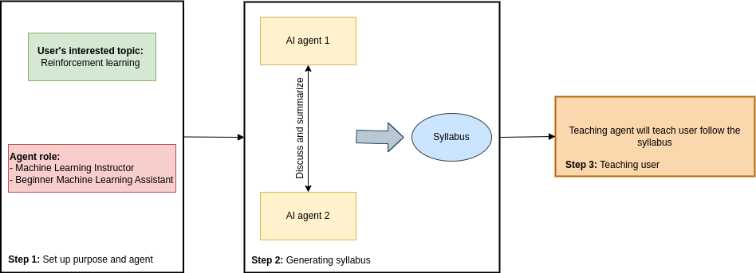

# :book: EduGPT - Your AI Instructor

This repo demonstrates an implementation of an AI Instructor using LLMs.

I leverage the [`langchain`](https://github.com/hwchase17/langchain) library in this implementation and are inspired by [CAMEL](https://github.com/camel-ai/camel) architecture .

## Overview

The AI Instructor project aims to revolutionize the way people learn by harnessing the power of artificial intelligence. It introduces a unique approach to education, where two role-playing agents engage in a discussion and design a syllabus based on the user's desired learning outcomes. Another agent, acting as the instructor, then teaches the user according to the syllabus.

## Key features

- Role-playing Agent Discussion: Two role-playing AI agents engage in a conversation and collaboratively design a syllabus based on the user's learning goals.
- Adaptive Instruction: The instructor agent adapts the teaching style and pace to match the user's preferences and learning abilities.
- Dynamic Learning Environment: The AI Instructor provides an interactive and engaging learning environment powered by advanced natural language processing and machine learning techniques.

## Architecture

The process follows these main steps:
- **Agent Initialization**: The AI agents are initialized with their extensive knowledge and capabilities in a specific domain.

- **User Query Understanding**: When a user inputs their desired learning topics, the AI agents receive and understand it through the prepared prompt.

- **Agent Dialogue and Collaboration**: The two AI agents, taking on the roles of discussion partners, engage in a dialogue to design a syllabus. They employ their respective expertise and knowledge to engage in a collaborative discussion. This dialogue involves exchanging ideas and exploring related concepts.

- **Syllabus Generation**: Through the conversation history of 2 agents, I will use a Large Language Model to generate a comprehensive syllabus that covers the user's desired topics. They prioritize and structure the content in a logical manner, ensuring a coherent progression of concepts and an organized learning experience for the user.

- **Instructor Agent Assignment**: Once the syllabus is created, a dedicated AI agent assumes the role of the instructor. It receives and adapts its approach to suit the syllabus.

By leveraging the expertise of two AI agents and employing adaptive instruction techniques, the AI Instructor project aims to provide a personalized and dynamic learning environment. Users can benefit from the collaborative syllabus design process and the tailored instruction delivered by the dedicated instructor agent, resulting in an enhanced and effective learning experience.

## Installation

Make sure your have python 3.10+ and run this command to setup environment:

`make venv`

Create `.env` file and put your Open AI Key there by specifying a line:

`OPENAI_API_KEY=sk-xxx`

## Usage

To get a feel for a conversation with the AI Instructor agent, you can run:

`python src/run.py`

from your terminal. Then, open the link provided by Gradio.

To interact with this AI Instructor:
- First, you need to input your interested topic in the tab *Input Your Information*.
- Then, it will design a syllabus of that topic for you.
- Finally, feel free to interact with your instructor, you can ask them to teach you from that syllabus.

## Contact Us

For questions, you can [contact the repo author](mailto:huynhquynhanh2003@gmail.com).

## Contributing

Contributions are highly encouraged!